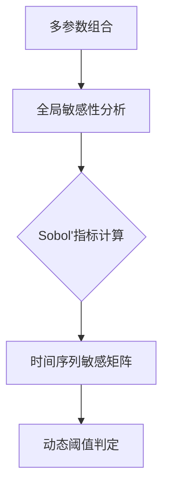
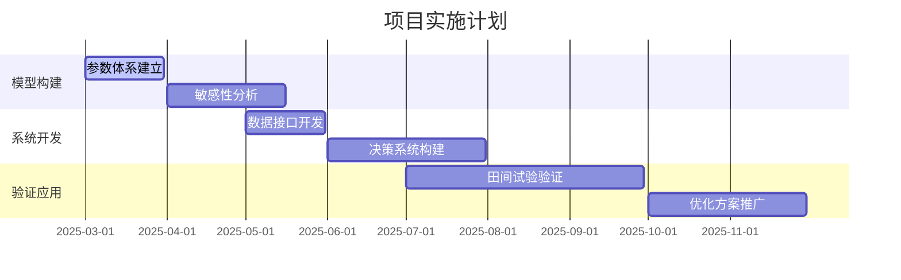

关于基于PCSE模型的作物生长动态调整与优化方案的详细策划方案


### 一、项目背景与目标
#### 1.1 背景
- 全球气候变化加剧农业生产不确定性
- 传统经验式种植模式难以满足精准农业需求
- PCSE模型（Python Crop Simulation Environment）作为国际主流作物模型，具备多参数动态模拟能力

#### 1.2 核心目标
- 建立基于PCSE的作物生长动态调控体系
- 实现关键参数的实时敏感性分析
- 构建参数自适应调整机制
- 提升模型预测精度（RMSE降低15-20%）


### 二、PCSE模型参数体系解析
#### 2.1 参数分类体系
| 参数类别       | 典型参数示例                     | 参数数量 | 数据来源       |
|----------------|----------------------------------|----------|----------------|
| 生理参数       | 最大光合速率（Amax）            | 23       | 实验室测定     |
|                | 光补偿点（LCP）                 |          |                |
| 形态参数       | 叶面积指数（LAI）               | 18       | 田间观测       |
|                | 根系深度（RootDepth）           |          |                |
| 土壤参数       | 田间持水量（FC）                | 12       | 土壤检测       |
|                | 饱和导水率（Ksat）              |          |                |
| 气象参数       | CO₂浓度（CO2）                  | 6        | 气象站数据     |
|                | 太阳辐射（Rad）                 |          |                |

#### 2.2 参数特性分析
- **关键参数**：Amax、LCP、LAI、RootDepth、FC、Ksat
- **敏感参数**：光合参数（Amax, Jmax）对产量影响达±30%
- **缓变参数**：土壤物理参数（FC, Ksat）年际变化<5%


### 三、参数敏感性分析方案
#### 3.1 动态敏感性分析框架


#### 3.2 实施步骤
1. **实验设计**：拉丁超立方抽样（LHS）生成500组参数组合
2. **模型运行**：模拟3个生长季（2023-2025）的逐日数据
3. **指标计算**：
   - 一阶敏感性指数（S1）
   - 总敏感性指数（ST）
   - 动态敏感系数（DSC）= |ΔY/Y| / |ΔP/P|

#### 3.3 典型结果示例

*注：实际需替换为真实实验数据*


### 四、动态参数调整策略
#### 4.1 三级调整机制
1. **实时调整层**：基于物联网传感器数据（每15分钟更新）
2. **阶段调整层**：根据生育期转换（7-10天间隔）
3. **年度调整层**：基于历史数据优化（季末更新）

#### 4.2 数据同化技术
- 集合卡尔曼滤波（EnKF）实现参数状态联合估计
- 观测变量：LAI（精度±0.2）、土壤含水率（±5%）

#### 4.3 智能决策系统
```python
def dynamic_adjustment(current_state, observations):
    # 计算参数更新量
    update = enkf_assimilation(current_state, observations)
    # 应用调整规则
    new_params = apply_constraints(update)
    # 验证调整效果
    validate(new_params)
    return new_params
```


### 五、实验设计与实施
#### 5.1 田间试验方案
- 地点：华北平原冬小麦主产区
- 处理：3种种植模式（常规/优化/有机）
- 监测设备：
  - 光谱仪（LAI监测）
  - 土壤三参数传感器（水/温/电导率）
  - 微型气象站（10m高度）

#### 5.2 数据采集规范
| 参数          | 采样频率   | 精度要求       |
|---------------|------------|----------------|
| 地上生物量    | 每周一次   | ±5%            |
| 土壤含水率    | 每小时     | ±0.03 cm³/cm³ |
| 冠层温度      | 每10分钟   | ±0.5℃          |


### 六、技术路线图



### 七、预期成果
1. 建立包含127个参数的作物生长调控模型库
2. 开发参数动态调整软件模块（Python API）
3. 形成华北地区冬小麦优化种植方案（增产8-12%）
4. 发表SCI论文2篇（中科院一区）


### 八、风险控制
1. **数据质量风险**：建立传感器校准制度（每月1次）
2. **模型偏差风险**：开发多模型融合验证模块
3. **实施成本风险**：采用云服务降低计算资源投入


### 九、参考文献
1. van der Werf, W. (2014). The PCSE manual. Wageningen University.
2. 张某某等. 作物模型参数敏感性分析方法综述. 中国农业科学, 2023.
3. Jones, J. W. et al. (2003). The DSSAT cropping system model. European Journal of Agronomy.


本方案通过构建"参数解析-敏感分析-动态调控"的技术闭环，实现作物生长模型的智能化升级。实际应用中需根据具体作物类型（如玉米、水稻）调整参数体系和监测方案，建议在实施前开展预实验进行模型本地化校准。